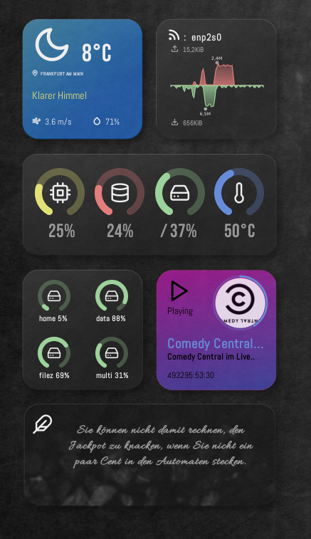

# Mimod: The Autonomous Desktop Dashboard

Mimod is an **"Invisible-Maintenance"** Conky suite built on a sophisticated backend of Bash and Lua scripts. Unlike traditional themes that require manual coordinate entry and file editing, Mimod features a self-evolving architecture that detects your hardware, locates your position, and sanitizes its own data streams in the background.

---

## ── The Autonomous Core ───────────────────────────────

### 🛰️ Self-Configuring Geolocation Engine
The weather module doesn't just fetch data; it configures the theme for you.
* **Multi-Layered Detection:** Automatically triggers a `geoclue-2.0` agent, falling back to IP-based location services if GPS/Wi-Fi positioning is unavailable.
* **Auto-Injection:** Once a location is found, the script dynamically rewrites its own configuration file, injecting the correct City ID, localized language, and regional units (Metric/Imperial) without user input.
* **Global Synchronization:** Location-based units automatically propagate to the system monitor.

### 🎵 Multimedia Scavenger & Processor
Mimod treats media metadata as raw data that needs refinement.
* **Metadata Sanitization:** An intelligent filter scrubs "Official Video," "HD," and "Topic" tags from stream titles for a clean UI.
* **Recursive Cover Discovery:** If a player lacks artwork, a background scavenger triggers a prioritized search:
    * *Local Cache ➔ Player Metadata ➔ TV Logo Repositories ➔ Deezer API ➔ iTunes API ➔ MusicBrainz.*
* **Dynamic Image Alchemy:** Uses **ImageMagick** to perform real-time circular cropping and padding, ensuring that even rectangular stream logos are rendered as perfect, centered dashboard elements.

### 📺 Live Stream & TV Awareness
Beyond standard music players, Mimod detects when you are watching live TV or network streams via VLC, MPV, or browsers. It identifies the broadcaster and pulls high-resolution network logos from a curated repository database.

### 🌐 Intelligent API Management
* **Anti-Blocking Strategy:** All background requests cycle through a rotating library of modern User-Agents and referer headers to bypass API rate-limiting and browser-agent blocks.
* **Round-Robin Quoting:** The quote engine balances load across ZenQuotes, BrainyQuote, and Quotable.
* **Neural Translation:** Integrates `translate-shell` to detect the quote origin and translate it into the theme's auto-detected local language on the fly.

### 🔌 Adaptive Hardware Mapping
* **Dynamic Mount Sensing:** Instead of static paths, Mimod uses `findmnt` to scan for new volumes in `/media`, `/run/media`, and `/mnt`, automatically mapping them to the UI slots as they are connected.
* **Active Interface Routing:** The networking logic ignores virtual bridges, tunnels, and inactive ports, locking onto the primary data-carrying interface (Wi-Fi or Ethernet) in real-time.

---

## ── Technical Architecture ────────────────────────────

* **Execution Safety:** Uses `flock` file-locking to ensure background scripts never collide or consume redundant CPU cycles.
* **Performance Rendering:** A high-frequency **Cairo/Lua** engine handles the 60FPS animations and 80-point network history charts, while heavy API and image tasks are offloaded to asynchronous Bash processes.
* **Memory Management:** Implements aggressive Lua garbage collection to maintain a negligible footprint during long sessions.

---

## ── Dependencies ────────────────────────────────────

| Category | Requirements |
| :--- | :--- |
| **Runtime** | `conky`, `lua5.x`, `libcairo2` |
| **Logic & Data** | `playerctl`, `imagemagick`, `jq`, `curl`, `findmnt` |
| **Optional** | `translate-shell` (quotes), `geoclue-2.0` (GPS location) |
